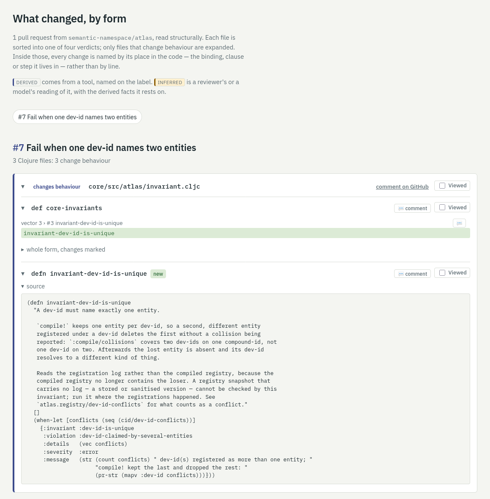
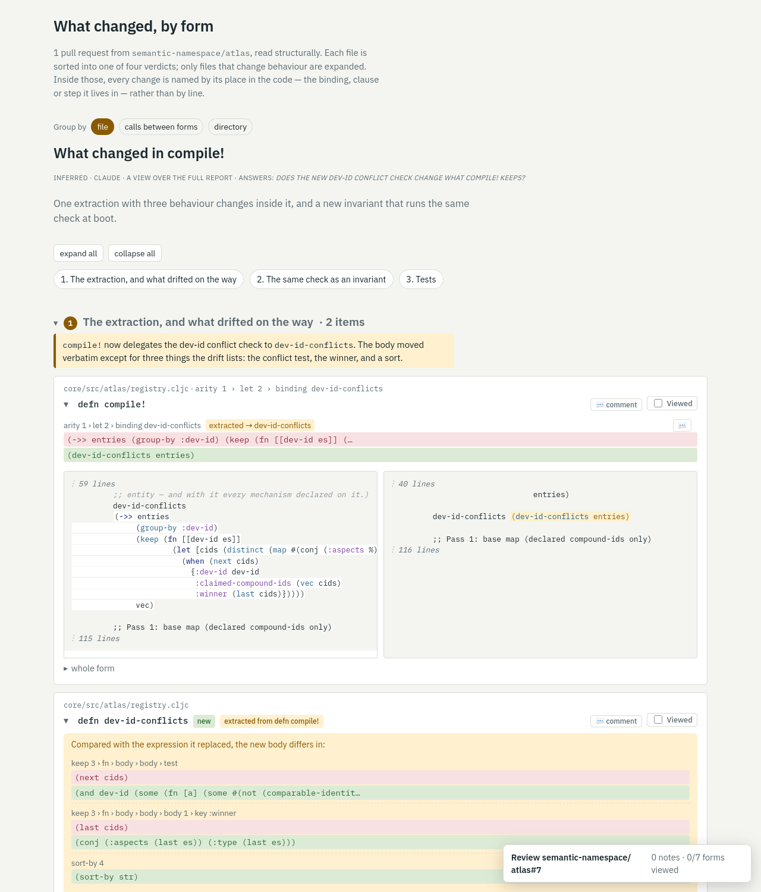

# diff

Structural review of Clojure changes. Instead of lines, a change is named by the
form it lives in:

```
■ core/src/atlas/registry.cljc   [semantic]
  defn compile!
    ~ arity 1 › let 2 › binding dev-id-conflicts  [extracted → dev-id-conflicts]
  defn dev-id-conflicts   ⇠ extracted from defn compile! › arity 1 › let 2 › binding dev-id-conflicts
    + new form
      drift: replaced keep 3 › fn › body › body › test  - (next cids)  + (and dev-id (some …
      drift: replaced keep 3 › fn › body › body › body 1 › key :winner  - (last cids)  + (conj …
      drift: added sort-by 4  + (sort-by str)
```

Each file gets one verdict: `semantic`, `rename-only`, `comments-only` or
`whitespace-only`. Inside a semantic file, every change is a path through the
code (binding, clause, argument, body step) with the old and new expression,
the sub-expressions that survived, moves between slots, and extractions of an
existing expression into a new function, including what drifted on the way and
which locals were renamed. A form that changed visibility, was wrapped by a new
macro, or was renamed and rewritten shows as one change (`⇠ was …`), not as a
removal and an addition.

## What it looks like

The report page of a pull request of
[semantic-namespace/atlas](https://github.com/semantic-namespace/atlas/pull/7):
files by verdict, each changed form with its changes named by path, a comment
button and a Viewed tick per form, the review panel at the bottom right.



A view over the same pull request, composed by a reviewer or a model: sections
with a claim each, the forms and changes they rest on, and everything else
folded at the end.



## Use

Babashka, no install beyond the repo:

```
bb sdiff text <repo> <base> <head>
bb sdiff edn  <repo> <base> <head>
bb sdiff html <repo> <out.html> <github-url|-> (<base> <head> <num> <title>)+
```

Ranges are diffed from the merge base of `base` and `head`, which is what a
pull request shows. For a squash-merged commit `C`, pass `C^ C`.

GitHub pull requests are read through the `gh` CLI with your own credentials,
without a clone:

```
bb sdiff pr <owner/repo#N|url> [text|edn|html <out.html>]
bb sdiff review <owner/repo#N|url> <notes.edn> [--post]
```

`review` turns notes written against form paths into a GitHub review. A notes
file looks like this:

```clojure
{:verdict :request-changes
 :summary "The extraction changes behaviour, see below."
 :notes [{:file "core/src/atlas/registry.cljc"
          :form "defn compile!"
          :at   "arity 1 › let 2 › binding dev-id-conflicts"
          :body "Was the new :winner value intended?"}]}
```

It prints where each note lands, inline on a head-side line or in the review
body when GitHub would refuse it inline, then the payload. With `--post` it
asks before posting as you.

`edn` is the contract for other tools: the report map with every node as
`{:src :row :col :end-row :end-col}`, so a consumer can print a form, anchor a
review comment to a head-side line, or re-read the source. `html` is a
self-contained page with the whole form shown and the changes marked.

As a library, `sdiff.core/file-report` takes a path and two source strings,
`sdiff.git/report` takes a repo and two refs, `sdiff.edn/report->edn` makes the
result plain data.

## Local review UI

```
bb sdiff serve [port]      # http://127.0.0.1:7878/
```

Open a pull request by reference or URL. The page is the HTML report with a
💬 button on every changed form and change path, and a review panel:
verdict, summary, notes, a preview that shows where each note lands and the
exact payload, and a post button that asks before sending. It posts through
`gh` as you. The server listens on 127.0.0.1 only, and every write needs a
token printed into the page, so other sites in the browser can't use it.
Each changed form has its own Viewed tick, kept on this machine. A form you
marked viewed shows "changed" when a later push changes its code, and keeps its
mark through a rename. Viewed state, unsent notes and settings live in
`~/.local/state/sdiff/` (`SDIFF_STATE_DIR` overrides it), so they follow you
across browsers. Settings, in the review panel: fold forms you mark viewed,
fold files viewed on GitHub, mark a file viewed on GitHub once all its forms
are viewed (off by default, it writes as you), and fold files that only change
formatting, comments or names.

`bb sdiff serve 7878 --host <address>` serves on another interface, such as a
VPN address. Anyone who can reach that address can then read PRs and post
reviews as you.

### Running it as a daemon

`systemd/sdiff.service` runs the UI as a user service, so it survives logouts,
reboots and crashes. Edit `WorkingDirectory`, the path to `bb` and the `serve`
arguments to match your machine, then:

```
cp systemd/sdiff.service ~/.config/systemd/user/
systemctl --user daemon-reload
systemctl --user enable --now sdiff
loginctl enable-linger $USER      # start at boot, without a login
```

`systemctl --user restart sdiff` picks up a new checkout, `journalctl --user
-u sdiff -f` follows its log. The service runs `gh` as you, so `gh auth status`
must already work for your user.

## Derived and inferred

Everything on the page is one of two kinds, and labelled. **Derived** content
comes from a tool named on the label: the structural changes from sdiff, and
whatever decorations a host registers beside each changed form or at the top
of the page (`sdiff.decorate/add-form-decorator!`, `add-header-decorator!`,
`use-context!`). The atlas `review` module registers decorations from a
registry: the entity a form declares with its contract delta, who depends on
it, which data keys it mentions. **Inferred** content is an annotation a
reviewer or a model attached to a form, an entity or the page, with its author
and the derived facts it rests on. `POST /annotate` stores them, the `annotate`
MCP tool posts them for you, and a panel setting hides the inferred layer.

## MCP server

The same operations as MCP tools (`structural-diff`, `review-draft`,
`post-review`, `annotate`), over stdio, on the JVM (plumcp does
not run on babashka). `post-review` is annotated as a destructive write, so clients ask before calling it.
It acts with the `gh` credentials of whoever runs it.

```
claude mcp add sdiff -- bash -c 'cd /path/to/diff && exec clojure -M:mcp'
```

Set `SDIFF_MCP_DEBUG=1` to log MCP
traffic to stderr.

## Tests

```
bb test
```

The fixtures are the changed Clojure files of three merged
[semantic-namespace/atlas](https://github.com/semantic-namespace/atlas) pull
requests at merge base and head (`test/fixtures/atlas.refs`): #7 for an
extraction with drift, #4 for a move into a binding and a dropped reader
conditional, #2 for renames rolled up across files. Behaviours no atlas PR
exercises yet are covered by small inline sources in the test.

## Scope

This layer is syntactic. It knows nothing about what a form means in a given
codebase; a registry or ontology layer can take the EDN report and attach that.
